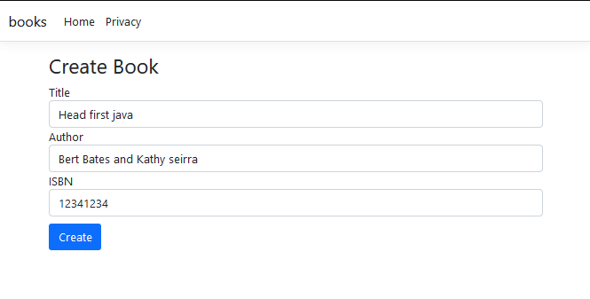
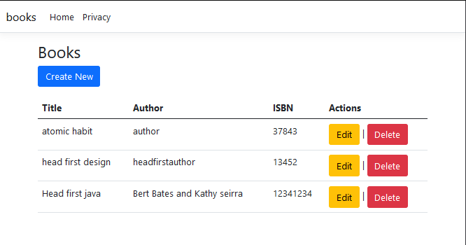
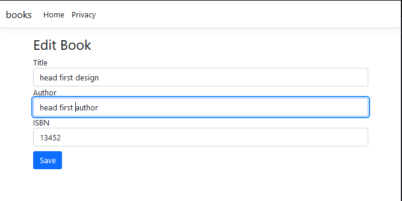
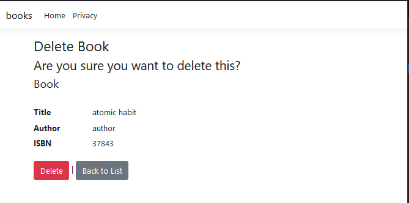

# Books Management Web Application

This web application allows users to manage a collection of books. Users can perform CRUD operations (Create, Read, Update, Delete) on books.

## Screenshots

| Action        | Screenshot                         |
|---------------|------------------------------------|
| Create Book   |          |
| Listing Page  |        |
| Edit Page     |              |
| Delete Page   |          |

## Getting Started

To run this project locally, follow these steps:

1. Clone the repository.

2. Set up the database by running migrations.

3. Build and run the project.

## Features

- **View Books**: The `Index` page displays a list of all books with options to edit or delete each book.

- **Add Book**: Users can add a new book by filling out the `Create` form.

- **Edit Book**: Existing books can be edited by clicking the `Edit` button on the `Index` page.

- **Delete Book**: Books can be deleted by clicking the `Delete` button on the `Index` page.

## Technologies Used

- ASP.NET Core MVC

- Entity Framework Core

- HTML/CSS

## Code Structure

- `BookController.cs`: Contains actions for CRUD operations.

- `BooksEntity.cs`: Defines the Book model.

- `Index.cshtml`: Displays the list of books with options to edit or delete.

- `Create.cshtml`: Form for adding a new book.

- `Edit.cshtml`: Form for editing an existing book.
